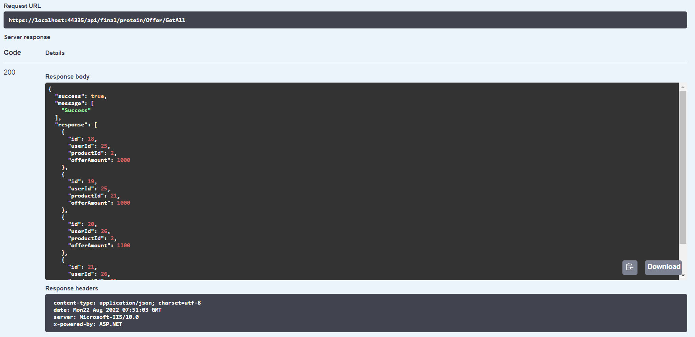
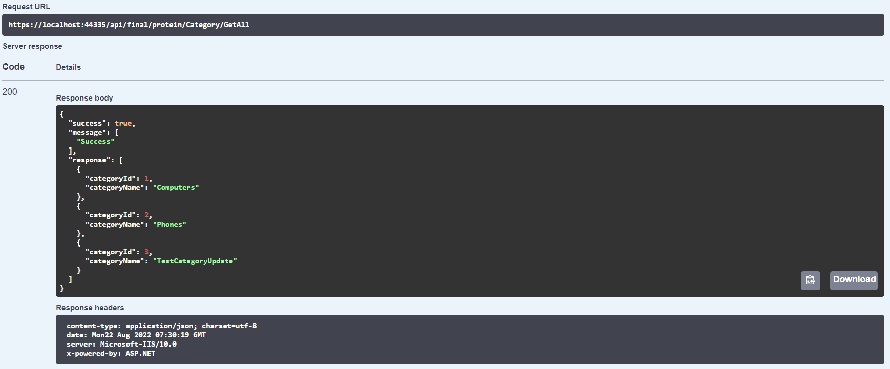

# BitirmeProjesi-gorkemetem
Bu proje kullanıcıların register ve login olabildiği, ürünlere teklif verebildiği ve bu ürünleri satın alabildikleri bir alışveriş uygulamasıdır.

Projede rolle yetkilendirme kullandım. Bu yetkileri database tarafında kendim verdim. Methodların üzerinde bulunan
attribute'lar ile kullanıcıların yetkilerini kontrol ettim.

Cache ve validation işlemlerini için aspect oriented programming ile gerçekleştirdim.

Aşağıda controller'larda bulunan methodlarının örnek ekran görüntüleri bulunmaktadır.

Not:
- DeleteOffer fonksiyonu tam doğru çalışmıyor. Yeni farkettiğim için düzeltmek için zamanım kalmayabilir. 

      Register ve Login:
   

      Offer:
   

      Product:
   

      Category:
   

